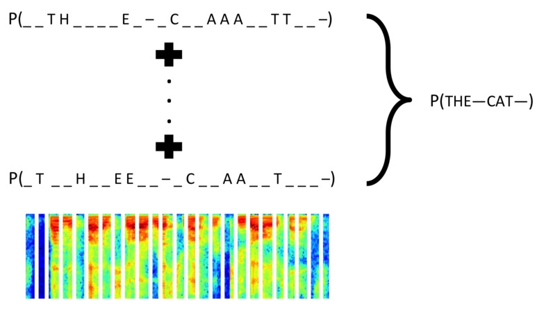

# പൊട്ടൻ ഒ.സി.ആർ

https://github.com/harish2704/pottan-ocr

# ഇത് എന്താണ് ?

1. ഇതൊരു machine learning ( കൃത്യമായി പറഞ്ഞാൽ deep learning ) അടിസ്ഥാനമാക്കി പ്രവർത്തിക്കുന്ന ഒരു OCR ആണ്.

2. ഇതിനെ അനുയോജ്യമായ ഒരു ഡാറ്റാസെറ്റ്  ഉപയോഗിച്ച് പരിശീലിപ്പിച്ചാൽ, ഇതിന് ഒരു ചിത്രത്തിൽ നിന്ന്  വാചകത്തെ ടെക്സ്റ്റ് രൂപത്തിൽ‌ തിരിച്ചറിയാൻ സാധിക്കും .

	- ഒരു വാചകം + അതിന്റെ ഒരു ചിത്രരൂപം . ഇതാണ്  "പൊട്ടനെ" പരിശീലിപ്പിക്കാൻ വേണ്ട ഡാറ്റാസെറ്റിന്റെ ഏറ്റവും ചെറിയ ഒരു യൂണിറ്റ് .

# ഇത് എങ്ങനെ പ്രവർത്തിക്കുന്നു ?

1. ആദ്യമായി  കൊടുക്കുന്ന ചിത്രത്തിൽ നിന്ന്  ലഭ്യമായ വരികളെ  ചിത്ര രൂപത്തിൽ തന്നെ വേർതിരിച്ച് എടുക്കുന്നു. 
	- ഇത് ചെയ്യാൻ  നിലവിൽ machine learning / deep learning ഉപയോഗിക്കുന്നില്ല.( ഭാവിയിൽ  ഉപയോഗിക്കും )
	- ocropus എന്ന പ്രൊജക്റ്റാണ്  ഈ പണി ചെയ്യുന്നത്.

2. വേർതിരിച്ചെടുത്ത ഓരോ വരികളുടേയും  ചിത്ര രൂപത്തിൽ നിന്ന്  ഓരോ വരികളേയും ടെസ്ക്റ്റ്  വേർതിരിച്ച് എടുക്കുന്നു.
	- ഇവിടെ മാത്രമാണ്  Deep learning ഉപയോഗിക്കുന്നത് 

3. വേർതിരിച്ചെടുത്ത വരികളെ അതേ ക്രമത്തിൽ കൂട്ടിച്ചേർത്ത് ഔട്പുട്ട്  തയ്യാറാക്കുന്നു 
	- ഇത് ചെയ്യാൻ  നിലവിൽ machine learning / deep learning ഉപയോഗിക്കുന്നില്ല.( ഭാവിയിൽ  ഉപയോഗിക്കും )
	- ocropus എന്ന പ്രൊജക്റ്റാണ്  ഈ പണി ചെയ്യുന്നത്.

# Machine learning / Deep learning

* അടിസ്ഥാനപരമായി ഇത്  CRNN എന്ന് അറിയപ്പെടുന്ന ഒരു മോഡലാണ് . Convolutional-recurrent networks എന്ന്  പൊതുവായി പറയാം  

* [ Model architecture ](img/model.png)
	- Input -> `Convolutional network ( CNN )` ->  Recurrent network ( RNN ) ->  `CTC` -> Output

* ഇൻപുട്ട് ഇമേജിൽ നിന്ന്  feature extraction നടത്തുന്നത്  Convolutional network ആണ്. 

	- 

* Convolutional network ന്റെ  ഔട്പുട്ടിൽ‌നിന്ന് , പലരീതിയിലുള്ള sequence കളെ തിരിച്ചറിയുക എന്നതാണ്  RNN ചെയ്യുന്നത് 

* ഇങ്ങനെ സീക്വൻസുകളെ  തിരിച്ചറിയാൻ വേണ്ടി മാത്രം രൂപകൽപന ചെയ്തിട്ടുള്ള ഒരു Loss function ആണ്   CTC ( Connection list Temporal Classification )

### CTC

#  ഇതുപയോഗിച്ച് എന്തൊക്കെ ചെയ്യാം 

1. പൊട്ടനെ ഏതു ഭാഷയിലേക്കു വേണ്ടിയും പരിശീലിപ്പിക്കാം
	- ഒരു ഭാഷയിലുള്ള പലരീതിയിലുള്ള യൂണിക്കോഡ്  ഫോണ്ടുകൾ, വൈവിധ്യപൂർണ്ണമായ കുറച്ച് യൂണികോഡ് ടെക്സ്റ്റ് എന്നീ രണ്ട്‌ കാര്യങ്ങൾ മാത്രമേ‌ അതിനായി ആവശ്യമുള്ളൂ.

2. മനുഷ്യാധ്വാനമുപയോഗിച്ച് , മുന്നേ ഡിജിറ്റൈസ് ചെയ്തിട്ടുള്ള ടെക്സ്റ്റുകൾ ഉപയോഗിച്ച് പരിശീലിപ്പിച്ചാൽ, ഇതിനു കൂടുതൽ കൃത്യതയോടെ കാര്യങ്ങൾ ചെയ്യാൻ സാധിക്കും   

 
# ഭാവി വികസന പദ്ധതികൾ 

1. Model optimization
2. വരികളെയും കോളങ്ങളേയും തിരിച്ചറിയാൻ മെഷീൻ ലേണിങ്ങ് തന്നെ ഉപയോഗിക്കുക.
3. തെറ്റുകൾ ചൂണ്ടിക്കാണിക്കാനും തിരുത്താനും, അവയെ  ഡാറ്റസെറ്റിലേക്ക് ഉൾപ്പെടുത്താനും  ഉള്ള ഒരു സിസ്റ്റം 

